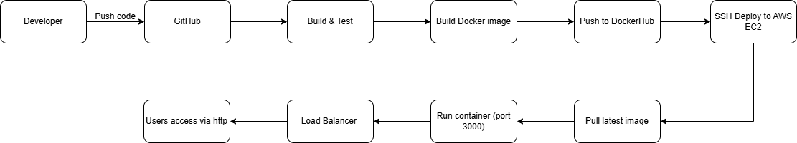

# Golden Owl DevOps Internship - CI/CD Pipeline

## 🚀 Overview

This project implements a CI/CD pipeline for a Node.js app using GitHub Actions and Docker.
The pipeline automatically builds, tests, and deploys the app to an AWS EC2 instance.

## 🧩 Pipeline Summary

1. **Build & Test** → Run npm lint + test
2. **Dockerize** → Build image from Dockerfile
3. **Push Image** → Upload to DockerHub (`haihh204/goldenowl-devops`)
4. **Deploy** → SSH to EC2 & restart container
5. **Access** → http://47.129.211.115:3000

## 🛠️ Tech Stack

- Node.js (App)
- Docker & DockerHub
- GitHub Actions
- AWS EC2 (Ubuntu 22.04)
- Nginx (reverse proxy)

## 📈 CI/CD Flow Diagram

**Flow Description:**

1. **Developer** pushes code to **GitHub**
2. **GitHub Actions** triggers **Build & Test** (lint + test)
3. If tests pass, **Docker image** is built
4. Image is pushed to **DockerHub**
5. **AWS EC2** pulls the latest image via SSH
6. Container runs on **port 3000**
7. **Load Balancer** distributes traffic
8. **Users** access the application via HTTP

## ✅ Deployment URL

👉 http://47.129.211.115:3000

## 👨‍💻 Author

Hoàng Huỳnh Hải— DevOps Intern Candidate
